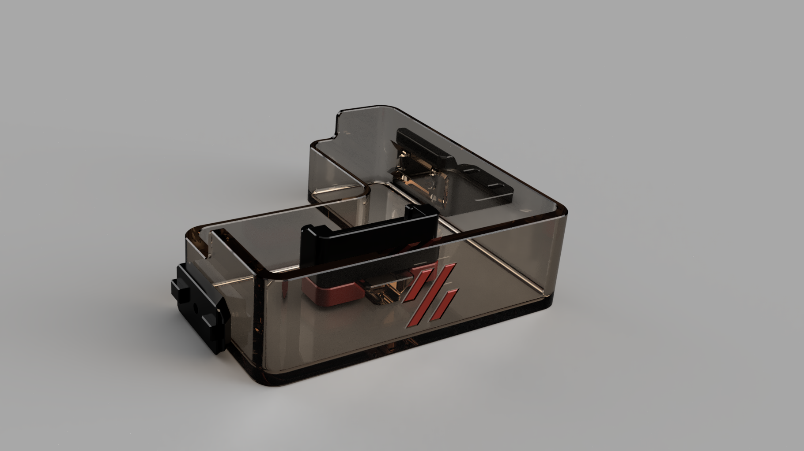
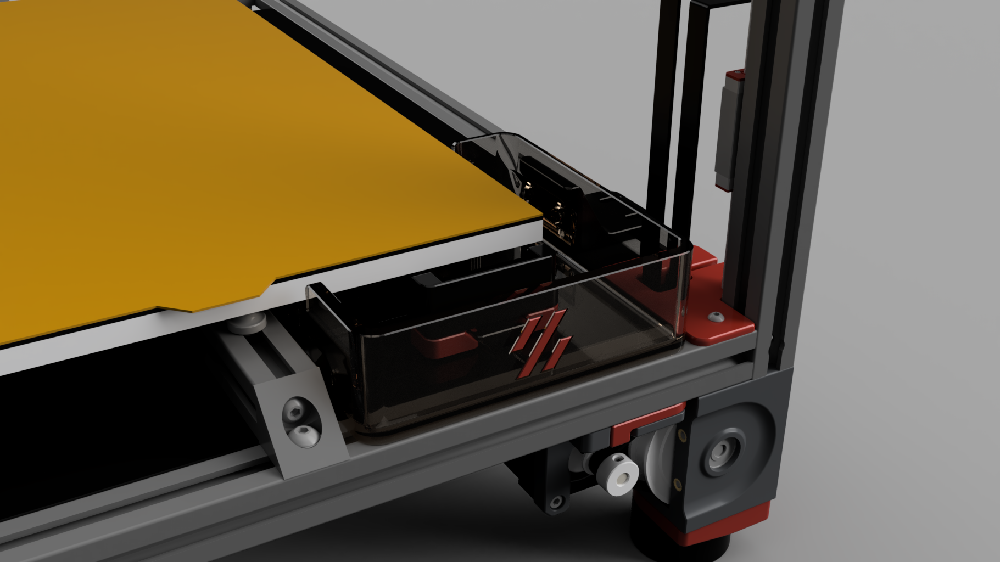

# **Front purge bucket**

This mod is for a purge bucket installed at the front of a Voron 2.4 3D Printer
It is relevant if you have replaced your Z endstop with the TAP sensor.

I wanted something where:
- The brush would be inside the bucket, so debris would fall down inside the bucket
- The brush/bucket should allow for easy placement of the PEI Flexsheet
- The brush's position on the Y axis should be adjustable to the beds's actual position
- It would be possible to purge alongside the bed, at X Max.
- Snap-fit magnet design

The whole bucket works as drawer, so you can pull it back while putting your flex plate back, and then push it forward.

Due to space restrictions, the 250mm version does not have an adjustable brush position, you'll have to adjust by adjusting the bucket's position.

## Assembly instructions

Depending if your printed the bucket as a dual color object, or if you printed the accent logo separately, glue the accents parts to the bucket.

Glue the magnets in both mounts and the bucket. Beware that both magnets have the right polarity, for the drawer effect to work.

*for 300mm or 350mm versions*
Install inserts in both clamps for the brush-holder and srew them losely to the brush holder.
Slide the assembly onto the mount in the bucket 

Install T-nuts in the corresponding extrusions and install both buckets mounts. Do not tighten yet, as you want to adjust the bucket position.

Slide the bucket drawer in, set positions, remove drawer, tighten and reiterate until you're happy.

Once the bucket has its final position, you can adjust the brush holder according to your bed's position and tighten both screws.

Slide a brush into the mount

Done.

## BOM

- 8x 6x3mm magnets (N35 or best N52)
- 1x M3x8mm conical head for the left bucket mount
- 2x M3x8mm screws for the right bucket mount
- 2x M3x12mm screws for the brush-holder (only 300 and 350mm versions)
- 2x heated inserts (only 300 and 350mm versions)
- 3x M3 T-nuts

## Authors

- falcon14141

