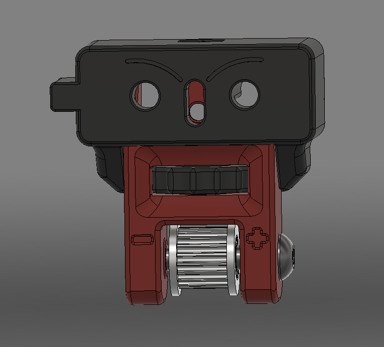
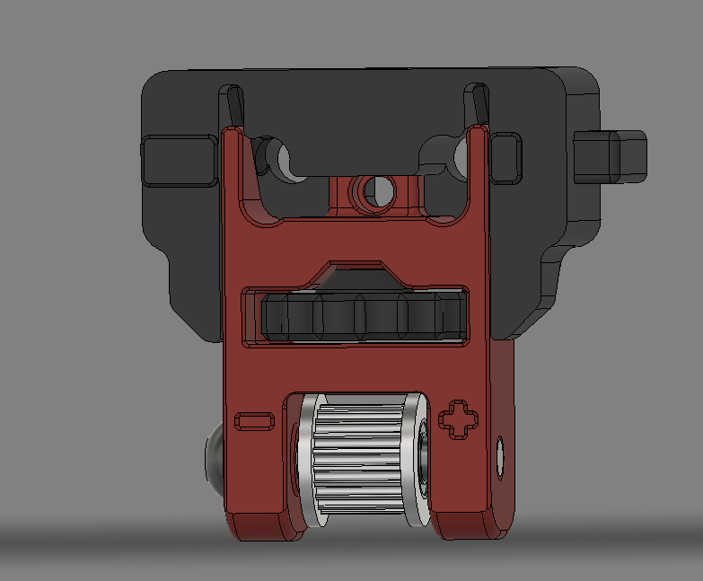

# Lovely Frog Z Idler

This is an alternative Z Idler for à Voron 2.4 3d Printer.
Is is a collective work of the French community on the Voron Discord

**Beware** The idler is longer than the stock one. This should not be an issue since there is plenty of room left on a standard V2.4
## BOM
In addition to the parts you already have from a standard 2.4 idler
- 4x M5x20mm bolts (with a hex head)
- 4x M5 Nuts
- 4x M3x12mm screws
- 4x heated insert for M3 screws according to the Voron BOM
## Documentation

The main benefit of this idler is to aligne the tensionning mechanism of the Z Belt with the Z Belt itself.
Tensionning is made easy by using a thumbwheel. 
It has a locking mechanism for additional help in securing the idler at the predefined tension.

It is compatible with any V2.4 Voron printer using 9mm belts.
It is also compatiple to a pin mod.

## Authors
Based on an idea of Bluecow.

- Bluecow
- Falcon14141
- Elpopo
- Fboc
- Frenesik
- Frix_x
- Jalpha
- Tircown

## Assembly

- Install the heated insert into the accent part 
- Slide the wheel into the idler
- Install the M5 nut in the frame mounted part
- Install the M5 screw into the wheel in the idler. Beware to properly align the hex flanges inside the wheel
- Turn the wheel until it stops. This should allow for a firm placement of both the screw and nut
- Install the pulley on the idler with either a screw or the pin mounted*
- Insert the M3 screw on the front of the frame part

The rest is almost as easy as the standard Idler