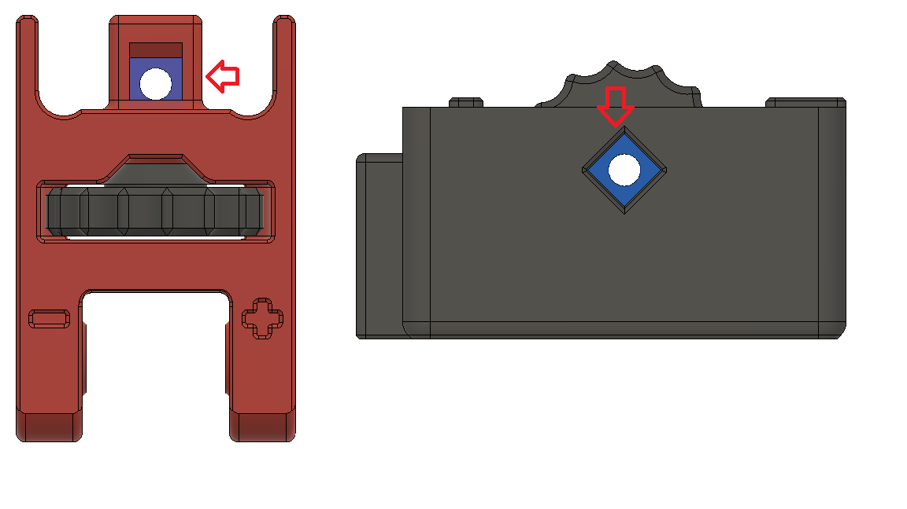

## A small mod of LFZI ##

LFZI is a wonderful mod of Z idlers fo Voron 2.4 

Aims :
- Fine tuning belt tension. Fine threading screws would be better, unfortunately fine threading M5 is hard/impossible to find. Step of M5 metric screw is 0.8mm , step of M3 is 0.5 mm. 
- Allow the use of 30 mm pins   

## Bill of materials ##

| Category | Qty |	Description | Notes |
| - | - | - | - |
| Hardware |	4  |	M3x20 HHS  | Hex head screws (DIN 933 or DIN 931 ) |  	 
| Hardware | 1 | M3 square nuts | ! DIN 562 not Hexagonal , not DIN 557 too |

## Assembly ##

The following picture shows wher M3 nuts should be placed. Otherwise fllows the original instruction.

