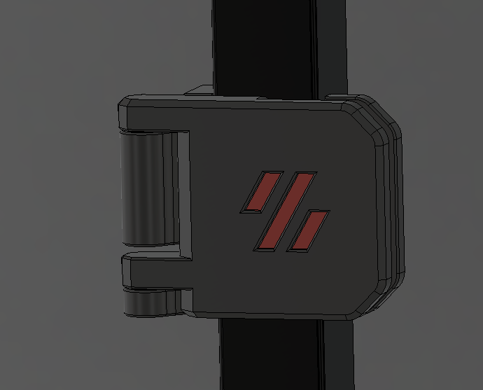
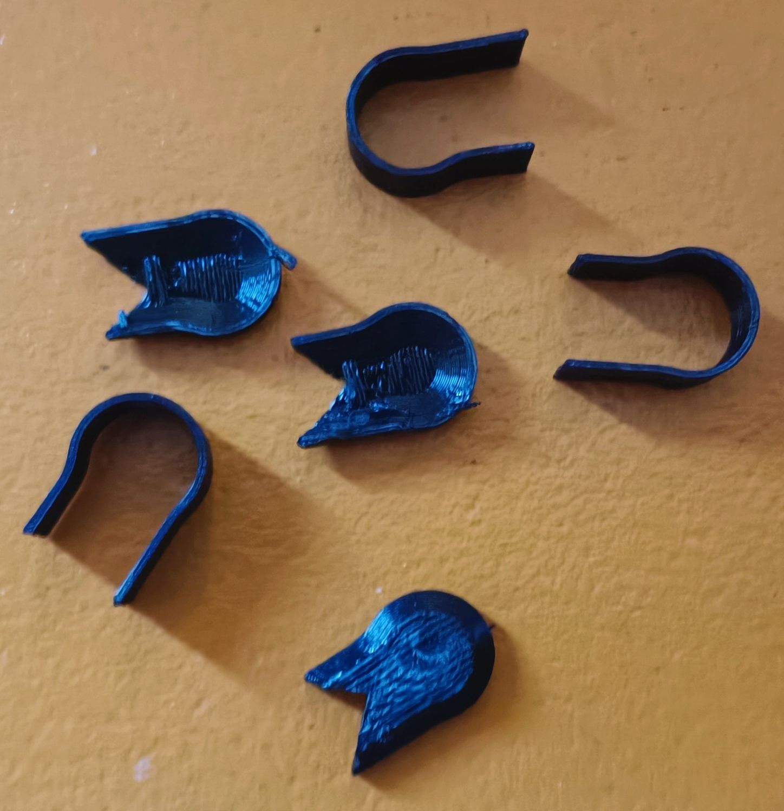
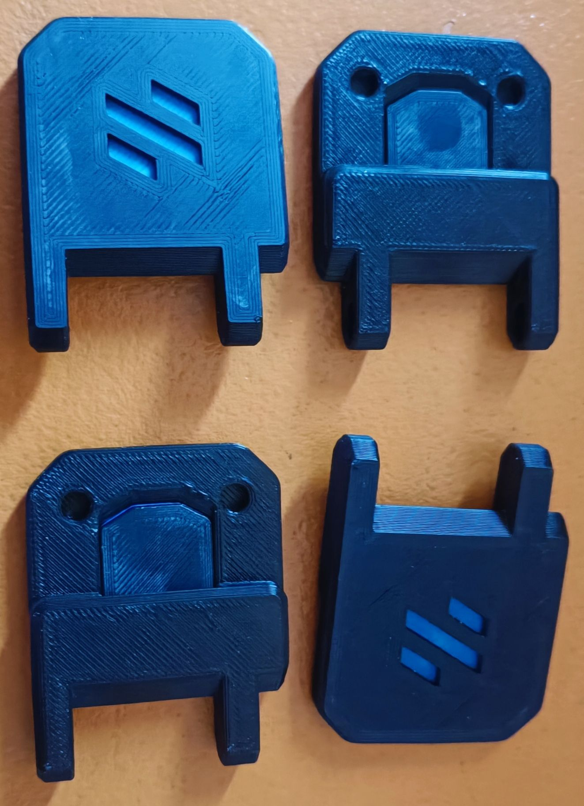

# Secure Magnet 270° Door Hinges

Get an easy access to your prints with thoses front doors. In an instant you can get them either fully opened (270°) or even remove them complitely taking advantage of the magnetic hinge magnets !

## Features

The provided 3mf files have been designed for 3mm plexi door panels
But the CAD is parametric, so you can adjust it to your own panel thickness in Fusion 360

## BOM
* 20 x 6x3 magnets : 2 for each FacePlate, 2 for each SideMonts and 4 for latches
* 4 x M3x8 sockethead screws for fixing SideMonts to extrusions
* 4 x M3 T-nuts for moutning the SideMonts to the extrusions
* 8 x heat inserts to mount the doors to the hinges
* 8 x M3x8 countersunk screws

## Print Settings
There is no need for supports as they are already integrated; recommended settings are 4 perimeters/top/bottom, at least 40% infill. The STL's are already oriented for you, so you only need to send them to the slicer. If you export the files for a custom panel thickness you'll have to reorient the files properly for printing.
## Assembly

* print all the stl parts. Some are in your main color, others in accent color (files begin with [a_]). Download files from the /stl folder

There are 2 parts for the assembly : one for the printer frame the other for the doors

PRINTER FRAME :

* Place and glue a magnet on the upper hole of each SideMounts WITHOUT removing supports to avoid breakage. *

* Remove supports from the SideMounts. There are 2 differents supports on the hindge itself. A circonference around it plus a kind of cone less easy to remove.
        
* Place and glue a magnet on the lower hole of each SideMounts

    Note : Mind the polarity of magnets, the FacePlates and SideMounts magnets have to attract each other, not to repulse !

* Attach the 4 SideMounts on the printer frame with M3x8 socket head bolts and M3 T-nuts. Note that the longer part of the hinge itself must be above the shorter part (photo)

DOORS :

* Join the inner and outer inlet and place them inside the FacePlates. If necessary, use a mallet or a flat pliers to push them in well.

* Place and glue a magnet on the 2 holes of each FacePlates

    Note : Mind the polarity of magnets, the FacePlates and SideMounts magnets have to attract each other, not to repulse !

* Place 2 heat inserts in each FacePlate holes *

* Drill your door panels with 3mm drill bit.  : 8 for the FacePlates on lateral faces of door panels and 8 for the latches at the upper and lower center of the doors. Be careful, plexy is fragile, so go gently and slowly to prevent the plexy from melting. You can use the provided Door-Drill Guide to help finding the right position of holes, or use existing holes

* Screw the counter plates with appropriate countersunk screws until you reach the heat inserts of the FacePlate

* Screw the 4 a/b handlers trough the door plexy panels

* Position the doors on the magnetic hinges 

You are set ! 

## Related

I have also made another version without magnets, and using chaicago bolts as hinges : [Rapidly removable 270° door hinges](https://github.com/falcon14141/Voron_Mods/tree/master/Rapidly%20removable%20270%C2%B0%20door%20hinges)

